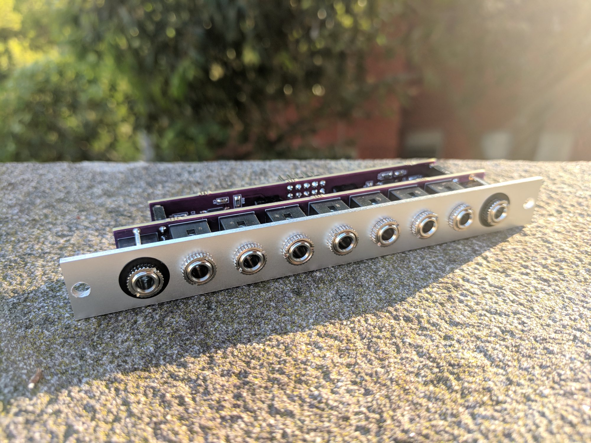

# Nearness

Minimal panning mixer for the Eurorack modular synthesizer system. Seven inputs, two outputs. The closer an input is to an output, the greater its influence on it. 3HP.

A product of the [*llllllll*](https://llllllll.co/t/prototyping-nearness-a-minimal-panning-mixer-module/8330) community.

## PCB

The [pcb](pcb) directory contains the schematic and PCB layout as a KiCad 5 project.

For convenience, the PCBs are available from OSH Park ([front](https://oshpark.com/shared_projects/fqV5h7cJ), [back](https://oshpark.com/shared_projects/oqCUYtxb)).

## Panel

The [panel](panel) directory contains a basic panel layout in SVG format, for use with a laser cutter or CNC machine.

Alternative panel designs are available:

- Joshua Goran ([files](https://llllllll.co/t/prototyping-nearness-a-minimal-panning-mixer-module/8330/66), [photos](https://llllllll.co/t/prototyping-nearness-a-minimal-panning-mixer-module/8330/92))
- Ben Moren ([repo](https://github.com/bmoren/nearness-black-gold-panel), [photos](https://llllllll.co/t/prototyping-nearness-a-minimal-panning-mixer-module/8330/112))

## Build guide

1. Start with the surface-mount components. Mind the orientation of the ICs and diodes.
2. Then do the pin headers.
3. Then the jacks.

## License

[CC BY-SA 4.0](http://creativecommons.org/licenses/by-sa/4.0/)
